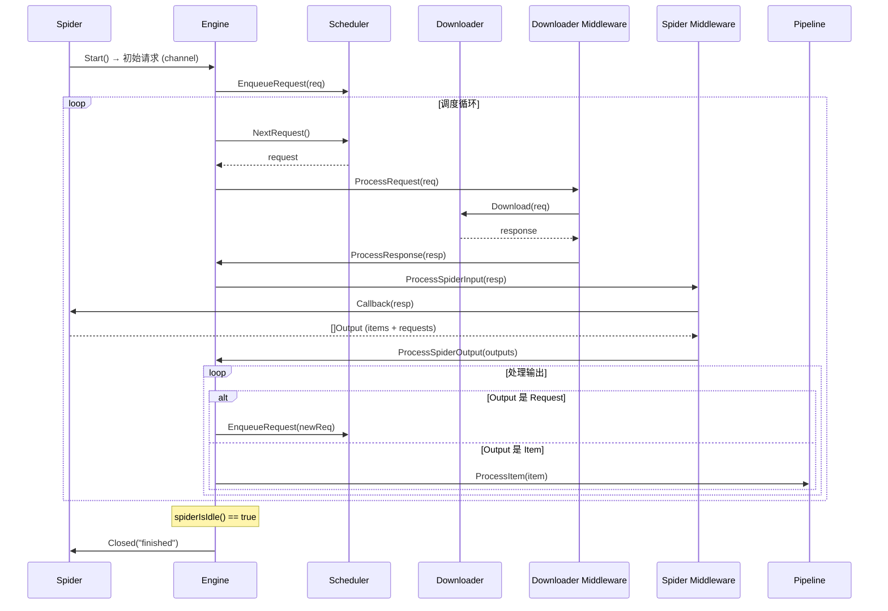
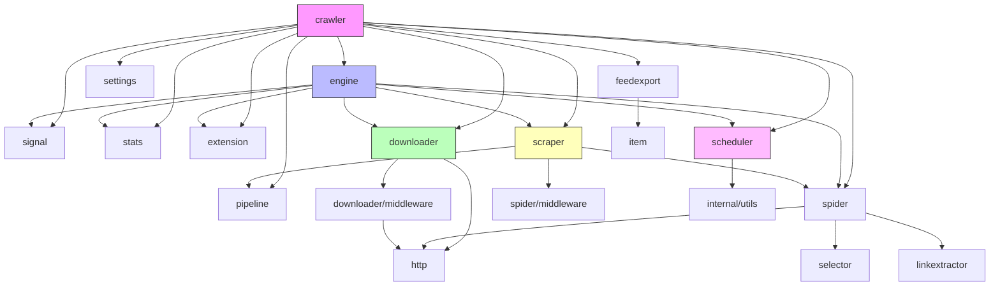

# 🏗 scrapy-go 架构设计文档

本文档详细描述 scrapy-go 框架的内部架构、组件关系、数据流和并发模型。

---

## 📑 目录

- [架构概览](#架构概览)
- [分层架构](#分层架构)
- [核心组件](#核心组件)
- [数据流](#数据流)
- [并发模型](#并发模型)
- [信号系统](#信号系统)
- [中间件架构](#中间件架构)
- [扩展系统](#扩展系统)
- [配置体系](#配置体系)
- [错误处理](#错误处理)
- [与 Scrapy 架构的差异](#与-scrapy-架构的差异)

---

## 架构概览

scrapy-go 采用经典的 Scrapy 五大组件架构，使用 Go 的 goroutine 和 channel 替代 Python Twisted 的事件循环：

```
┌─────────────────────────────────────────────────────────────────────────┐
│                           用户代码层                                     │
│  Spider (Parse/Callback)  │  Pipeline  │  自定义中间件  │  扩展          │
├─────────────────────────────────────────────────────────────────────────┤
│                         编排层 (Crawler / Runner)                        │
│  组件组装 │ 配置合并 │ 生命周期管理 │ 信号传播                            │
├─────────────────────────────────────────────────────────────────────────┤
│                         引擎层 (Engine)                                  │
│  调度循环 │ 请求分发 │ 响应路由 │ 空闲检测 │ 优雅关闭                      │
├──────────────┬──────────────┬──────────────┬────────────────────────────┤
│  Scheduler   │  Downloader  │   Scraper    │  Signal / Stats / Extension│
│  请求调度    │  HTTP 下载   │  回调执行    │  事件总线 / 统计 / 插件     │
├──────────────┴──────────────┴──────────────┴────────────────────────────┤
│                         基础设施层                                       │
│  Settings │ Log │ Pool │ Errors │ Telemetry │ Debug                     │
└─────────────────────────────────────────────────────────────────────────┘
```

---

## 分层架构

### 第一层：用户代码层

用户直接交互的 API：

- **Spider** — 定义爬取逻辑（`Parse` 回调、`StartURLs`）
- **Pipeline** — 数据处理管道（清洗、验证、存储）
- **自定义中间件** — 请求/响应拦截
- **扩展** — 生命周期钩子

### 第二层：编排层（Crawler / Runner）

- **Crawler** — 单爬虫编排器，组装所有组件并启动
- **Runner** — 多爬虫调度器，支持并发/顺序运行

### 第三层：引擎层（Engine）

框架的心脏，协调所有组件的数据流：

- 使用 `errgroup` 管理多个 goroutine 生命周期
- 心跳 + 即时通知双模式调度
- 两阶段优雅关闭

### 第四层：功能组件层

- **Scheduler** — 请求队列管理（内存队列 + 磁盘队列 + 去重过滤）
- **Downloader** — HTTP 下载（Slot 机制、并发控制、延迟控制）
- **Scraper** — 回调执行和结果分发
- **Signal** — 事件总线
- **Stats** — 统计收集
- **Extension** — 插件管理

### 第五层：基础设施层

- **Settings** — 多级配置系统
- **Log** — 彩色日志
- **Pool** — 对象池
- **Errors** — 错误类型体系
- **Telemetry** — 可观测性接口
- **Debug** — pprof 调试

---

## 核心组件

### Engine（引擎）

```
                    ┌─────────────────────────────┐
                    │          Engine              │
                    │                             │
                    │  ┌─────────────────────┐   │
                    │  │   errgroup 管理      │   │
                    │  │                     │   │
                    │  │  G1: consumeStart   │   │
                    │  │  G2: run (调度循环)  │   │
                    │  │  G3: watchOSSignals │   │
                    │  └─────────────────────┘   │
                    │                             │
                    │  scheduleNotify (chan)       │
                    │  heartbeat (ticker)         │
                    └─────────────────────────────┘
```

Engine 使用 `errgroup` 统一管理三个核心 goroutine：

1. **consumeStartRequests** — 消费 Spider 的初始请求
2. **run** — 主调度循环（心跳 + 即时通知）
3. **watchOSSignals** — OS 信号监听

任一 goroutine 出错会自动取消 context，触发其他 goroutine 退出。

### Scheduler（调度器）

```
┌─────────────────────────────────────────┐
│              Scheduler                   │
│                                         │
│  ┌─────────────┐   ┌─────────────────┐ │
│  │ DupeFilter  │   │  Priority Queue │ │
│  │ (去重过滤)  │   │  (优先级队列)   │ │
│  │             │   │                 │ │
│  │ Set-based   │   │ Memory Queue    │ │
│  │ Fingerprint │   │ Disk Queue      │ │
│  └─────────────┘   └─────────────────┘ │
│                                         │
│  EnqueueRequest() → DupeFilter → Queue  │
│  NextRequest()    ← Queue               │
└─────────────────────────────────────────┘
```

- **DupeFilter** — 基于请求指纹的去重过滤器
- **Memory Queue** — 内存优先级队列（有序切片，Pop O(1)，Push O(log N)）
- **Disk Queue** — 磁盘持久化队列（支持断点续爬，`JOBDIR` 配置）

### Downloader（下载器）

```
┌─────────────────────────────────────────────────┐
│                 Downloader                        │
│                                                  │
│  ┌──────────────────────────────────────────┐   │
│  │           Slot Manager                    │   │
│  │                                          │   │
│  │  domain_a → Slot { semaphore, delay }    │   │
│  │  domain_b → Slot { semaphore, delay }    │   │
│  │  domain_c → Slot { semaphore, delay }    │   │
│  └──────────────────────────────────────────┘   │
│                                                  │
│  ┌──────────────────────────────────────────┐   │
│  │      HTTPDownloadHandler                  │   │
│  │      (net/http.Client)                    │   │
│  └──────────────────────────────────────────┘   │
│                                                  │
│  全局并发: semaphore.Weighted(CONCURRENT_REQUESTS)│
│  域名并发: semaphore.Weighted(PER_DOMAIN)        │
└─────────────────────────────────────────────────┘
```

Slot 机制：
- 按域名分组管理并发
- 每个 Slot 独立的信号量控制并发数
- 支持下载延迟（`DOWNLOAD_DELAY`）和随机化

### Scraper（数据处理器）

```
┌─────────────────────────────────────────┐
│              Scraper                      │
│                                         │
│  Response → Spider Middleware (Input)    │
│           → Spider.Callback()            │
│           → Spider Middleware (Output)   │
│           → 分发:                        │
│              ├─ Request → Scheduler      │
│              └─ Item → Pipeline Manager  │
│                         ├─ Pipeline 1    │
│                         ├─ Pipeline 2    │
│                         └─ Pipeline N    │
│                                         │
│  并发控制: semaphore(CONCURRENT_ITEMS)   │
└─────────────────────────────────────────┘
```

---

## 数据流

scrapy-go 的数据流由 Engine 控制，完整流程如下：



### 数据流步骤详解

1. **Engine** 从 **Spider** 的 `Start()` channel 获取初始请求
2. **Engine** 将请求送入 **Scheduler** 排队（经过 DupeFilter 去重）
3. **Engine** 调度循环从 **Scheduler** 取出下一个请求
4. 请求经过 **Downloader Middleware** 链的 `ProcessRequest`
5. **Downloader** 执行 HTTP 下载，生成 Response
6. Response 经过 **Downloader Middleware** 链的 `ProcessResponse`
7. **Engine** 将 Response 送入 **Spider Middleware** 的 `ProcessSpiderInput`
8. **Spider** 的回调函数处理 Response，返回 Items 和新 Requests
9. 输出经过 **Spider Middleware** 的 `ProcessSpiderOutput`
10. **Engine** 将新 Requests 送回 **Scheduler**，将 Items 送入 **Pipeline**
11. 重复步骤 3-10，直到 Scheduler 为空且无 in-flight 请求

---

## 并发模型

### 与 Scrapy (Twisted) 的对比

| 维度 | Scrapy (Python) | scrapy-go |
|------|----------------|-----------|
| 并发模型 | Twisted 事件循环（单线程协作式） | goroutine（多核抢占式） |
| I/O 模型 | 异步 Deferred/Coroutine | goroutine + channel |
| 并发控制 | Twisted Semaphore | `semaphore.Weighted` |
| 生命周期 | Twisted reactor | `errgroup` + context |
| 取消传播 | Deferred.cancel() | `context.Context` |

### goroutine 模型

```
┌─────────────────────────────────────────────────────────────┐
│                        Engine                                │
│                                                             │
│  Main goroutine (调度循环)                                   │
│    │                                                        │
│    ├── G: consumeStartRequests (1个)                        │
│    │     └── 从 Spider.Start() channel 读取初始请求          │
│    │                                                        │
│    ├── G: watchOSSignals (1个)                              │
│    │     └── 监听 SIGINT/SIGTERM                            │
│    │                                                        │
│    └── G: downloadAndScrape (N个，每请求一个)                │
│          ├── Downloader Middleware 链                        │
│          ├── HTTP 下载                                      │
│          ├── Spider Middleware 链                            │
│          ├── Spider Callback                                │
│          └── Pipeline 处理                                  │
│                                                             │
│  并发控制:                                                   │
│    • 全局: semaphore.Weighted(CONCURRENT_REQUESTS)           │
│    • 域名: Slot.semaphore(CONCURRENT_REQUESTS_PER_DOMAIN)   │
│    • Item: semaphore.Weighted(CONCURRENT_ITEMS)             │
└─────────────────────────────────────────────────────────────┘
```

### 调度通知机制

Engine 使用双模式调度，确保低延迟和低 CPU 开销：

```go
// 心跳模式：每 5 秒检查一次
ticker := time.NewTicker(heartbeatInterval)

// 即时通知模式：有新请求时立即触发
scheduleNotify := make(chan struct{}, 1)

select {
case <-ticker.C:
    processScheduledRequests(ctx)
case <-scheduleNotify:
    processScheduledRequests(ctx)
}
```

### 背压控制（Backpressure）

```
needsBackout() == true 时停止取新请求:
  ├── Downloader 达到并发上限 (CONCURRENT_REQUESTS)
  ├── Scraper 达到 Item 处理上限 (CONCURRENT_ITEMS)
  └── Engine 正在关闭 (slot.closing)
```

---

## 信号系统

scrapy-go 的信号系统是一个同步事件总线，用于组件间解耦通信：

### 信号类型

```
┌─────────────────────────────────────────────────┐
│                 Signal Manager                    │
│                                                  │
│  引擎生命周期:                                    │
│    • EngineStarted    — 引擎启动                  │
│    • EngineStopped    — 引擎停止                  │
│                                                  │
│  Spider 生命周期:                                 │
│    • SpiderOpened     — Spider 打开               │
│    • SpiderIdle       — Spider 空闲               │
│    • SpiderClosed     — Spider 关闭               │
│                                                  │
│  请求/响应:                                       │
│    • RequestScheduled — 请求已调度                 │
│    • RequestDropped   — 请求被丢弃（去重）         │
│    • ResponseReceived — 响应已接收                 │
│                                                  │
│  调度器:                                          │
│    • SchedulerEmpty   — 调度器队列为空             │
│                                                  │
│  Item:                                           │
│    • ItemScraped      — Item 已处理               │
│    • ItemDropped      — Item 被丢弃               │
│    • ItemError        — Item 处理出错             │
└─────────────────────────────────────────────────┘
```

### 特殊错误语义

- **DontCloseSpider** — SpiderIdle 处理器返回此错误，阻止 Spider 关闭
- **CloseSpider** — 任意信号处理器返回此错误，触发 Spider 关闭

---

## 中间件架构

### 下载器中间件链

```
Request 方向 (ProcessRequest):
  优先级 100 → 300 → 400 → 500 → 545 → 550 → 600 → 700 → 800 → 900
  RobotsTxt → Auth → UA → Retry → CircuitBreaker → DefaultHeaders → Redirect → Cookies → Proxy → Cache
                                                                    ↓
                                                              Downloader
                                                                    ↓
Response 方向 (ProcessResponse):
  优先级 900 → 800 → 700 → 600 → 550 → 545 → 500 → 400 → 300 → 100
  Cache → Proxy → Cookies → Redirect → DefaultHeaders → CircuitBreaker → Retry → UA → Auth → RobotsTxt
```

### 中间件接口（接口隔离设计）

```go
// 全功能接口（向后兼容）
type DownloaderMiddleware interface {
    ProcessRequest(ctx, req) (*Response, error)
    ProcessResponse(ctx, req, resp) (*Response, error)
    ProcessException(ctx, req, err) (*Response, error)
}

// 细粒度接口（按需实现）
type RequestProcessor interface {
    ProcessRequest(ctx, req) (*Response, error)
}

type ResponseProcessor interface {
    ProcessResponse(ctx, req, resp) (*Response, error)
}

type ExceptionProcessor interface {
    ProcessException(ctx, req, err) (*Response, error)
}
```

### Spider 中间件链

```
Input 方向 (ProcessSpiderInput):
  Response → Depth → HttpError → Offsite → Referer → URLLength → Spider

Output 方向 (ProcessSpiderOutput):
  Spider → URLLength → Referer → Offsite → HttpError → Depth → Engine
```

---

## 扩展系统

扩展通过信号系统与框架交互，实现横切关注点：

```
┌─────────────────────────────────────────────────┐
│             Extension Manager                    │
│                                                  │
│  ┌─────────────┐  ┌─────────────┐              │
│  │  CoreStats   │  │ CloseSpider │              │
│  │  统计收集    │  │  条件关闭   │              │
│  └─────────────┘  └─────────────┘              │
│                                                  │
│  ┌─────────────┐  ┌─────────────┐              │
│  │  LogStats    │  │ MemoryUsage │              │
│  │  定期日志    │  │  内存监控   │              │
│  └─────────────┘  └─────────────┘              │
│                                                  │
│  ┌─────────────┐  ┌───────────────┐            │
│  │  FeedExport  │  │ AutoThrottle  │            │
│  │  数据导出    │  │  自适应限速    │            │
│  └─────────────┘  └───────────────┘            │
│                                                  │
│  生命周期: Open(ctx) → [信号交互] → Close(ctx)   │
│  关闭顺序: 逆优先级（后注册先关闭）              │
└─────────────────────────────────────────────────┘
```

### 内置扩展

| 扩展 | 功能 | 监听信号 |
|------|------|--------|
| CoreStats | 核心统计（请求数、响应数、Item 数等） | SpiderOpened, SpiderClosed, ResponseReceived, ItemScraped |
| CloseSpider | 条件关闭（超时、Item 数量、错误数量） | SpiderOpened, SpiderIdle |
| LogStats | 定期输出统计日志 | SpiderOpened, SpiderClosed |
| MemoryUsage | 内存使用监控和告警 | SpiderOpened |
| FeedExport | 数据导出到文件 | SpiderOpened, SpiderClosed, ItemScraped |
| AutoThrottle | 基于延迟反馈的自适应限速 | SpiderOpened, SpiderClosed, ResponseDownloaded |

---

## 配置体系

### 六级优先级

```
┌─────────────────────────────────────────┐
│  优先级 (高 → 低)                        │
│                                         │
│  6. Cmdline   — 命令行参数覆盖           │
│  5. Spider    — Spider.CustomSettings()  │
│  4. Project   — scrapy-go.toml / 代码    │
│  3. Addon     — 插件配置                 │
│  2. Command   — 命令默认值               │
│  1. Default   — 框架内置默认值           │
│                                         │
│  高优先级覆盖低优先级                    │
└─────────────────────────────────────────┘
```

### 配置冻结

```go
s := settings.New()
s.Set("KEY", "value", settings.PriorityProject)
s.Freeze() // 冻结后不可修改
s.Set("KEY", "new") // panic: settings frozen
```

### 组件优先级字典

用于管理中间件、Pipeline、扩展的启用/禁用和优先级：

```go
// 基础配置
base := map[string]int{
    "Retry":    500,
    "Redirect": 600,
    "Cookies":  700,
}

// Spider 覆盖：禁用 Cookies，调整 Retry 优先级
override := map[string]int{
    "Cookies": 0,    // 0 表示禁用
    "Retry":   300,  // 调整优先级
}

// 合并结果
merged := settings.MergeComponentPriority(base, override)
// → {"Retry": 300, "Redirect": 600}
```

---

## 错误处理

### 错误类型体系

```
┌─────────────────────────────────────────────────┐
│              pkg/errors                           │
│                                                  │
│  CloseSpiderError   — 触发 Spider 关闭           │
│  DropItemError      — 丢弃 Item                  │
│  IgnoreRequestError — 忽略请求                   │
│  NewRequestError    — 产生新请求（重试/重定向）   │
│  PanicError         — panic 恢复后的包装错误      │
│  HttpError          — HTTP 错误响应              │
│  NotConfiguredError — 组件未配置                  │
│                                                  │
│  哨兵错误:                                       │
│  ErrCloseSpider     — 关闭 Spider                │
│  ErrDropItem        — 丢弃 Item                  │
│  ErrIgnoreRequest   — 忽略请求                   │
└─────────────────────────────────────────────────┘
```

### Panic 恢复

所有用户代码入口点（Spider 回调、中间件、Pipeline）都有 panic recovery：

```go
defer func() {
    if r := recover(); r != nil {
        stack := string(debug.Stack())
        panicErr := serrors.NewPanicError(r, stack)
        logger.Error("panic recovered", "error", panicErr)
        stats.IncValue("spider_exceptions/panic", 1, 0)
    }
}()
```

---

## 与 Scrapy 架构的差异

| 维度 | Scrapy (Python) | scrapy-go | 原因 |
|------|----------------|-----------|------|
| 事件循环 | Twisted reactor（全局单例） | `errgroup` + context | Go 无全局 reactor |
| 异步模型 | Deferred / async-await | goroutine + channel | Go 原生并发 |
| Spider 加载 | SpiderLoader（字符串名反射） | 直接传入实例 | Go 静态类型 |
| 配置系统 | Python dict + 模块属性 | 类型安全 Settings + TOML | 编译期检查 |
| 中间件注册 | settings.py 字典 | `AddDownloaderMiddleware()` 方法 | 显式优于隐式 |
| Item 定义 | scrapy.Item / dict | struct + `item` tag / map | Go 类型系统 |
| 序列化 | pickle | JSON 编码 | 跨语言兼容 |
| 日志 | Python logging | `log/slog` | Go 标准库 |
| 信号 | PyDispatcher（异步） | 同步事件总线 | 简化并发推理 |
| 进程管理 | CrawlerProcess（reactor 生命周期） | context 传播取消 | Go 惯用模式 |
| Shell | scrapy shell（交互式） | 不提供（Go 编译型） | 语言特性限制 |
| Telnet | telnet console | pprof HTTP 端点 | Go 生态标准 |

### 舍弃的 Scrapy 特性

以下 Scrapy 特性因不适合 Go 语言模型而被舍弃：

1. **scrapy shell** — Go 是编译型语言，不支持交互式 REPL
2. **Spider Loader** — Go 静态类型，无需字符串名反射加载
3. **CrawlerProcess** — Go 无全局 reactor，使用 context 管理生命周期
4. **Telnet Console** — 使用 pprof HTTP 端点替代
5. **pickle 序列化** — 使用 JSON，跨语言兼容
6. **Twisted Deferred** — 使用 goroutine + channel + errgroup
7. **scrapy.contracts** — 使用 Go 标准测试框架
8. **Media Pipeline** — 可通过自定义 Pipeline 实现

### 新增的 Go 特性

1. **编译期类型检查** — 接口实现检查 `var _ Interface = (*Impl)(nil)`
2. **对象池** — `sync.Pool` 减少 GC 压力
3. **pprof 集成** — 运行时性能分析
4. **errgroup 生命周期** — 统一多 goroutine 错误传播
5. **context 取消传播** — 优雅的级联取消
6. **semaphore.Weighted** — 可取消的并发控制
7. **Telemetry 接口** — OpenTelemetry 兼容的可观测性（`contrib/telemetry` 提供 OTel + Prometheus 适配器）

---

## 包依赖关系



---

## 性能设计要点

### 内存优化

- **对象池** — Request/Response/Bytes 复用，减少 GC 压力
- **有序切片优先级队列** — 避免 heap 接口的额外分配
- **channel buffer** — `scheduleNotify` 使用 buffer=1 避免阻塞

### 并发优化

- **同步路径添加 active** — `downloadAndScrape` 前同步将请求加入 active 集合，避免竞态
- **即时通知调度** — 新请求入队立即通知调度循环，减少延迟
- **semaphore.Weighted** — 支持 context 取消，避免 goroutine 泄漏

### 可靠性

- **panic recovery** — 所有用户代码入口点都有 panic 恢复
- **两阶段关闭** — 优雅关闭 + 强制退出
- **errgroup 错误传播** — 任一组件失败自动取消全部
